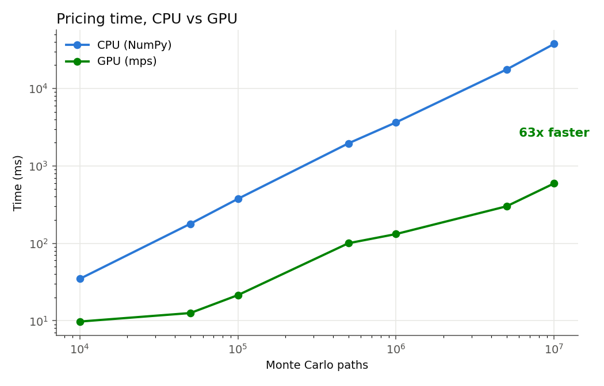
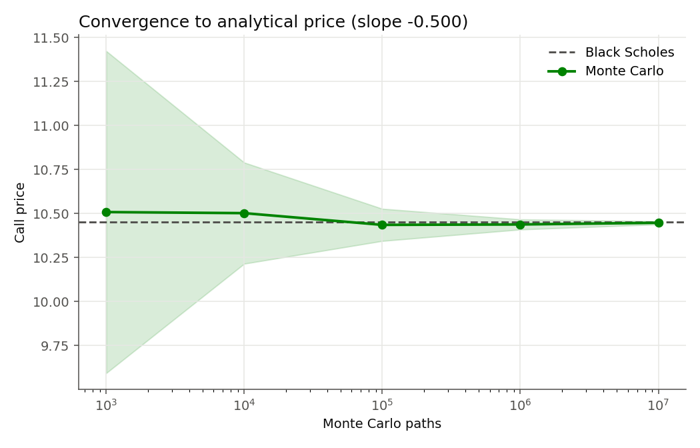
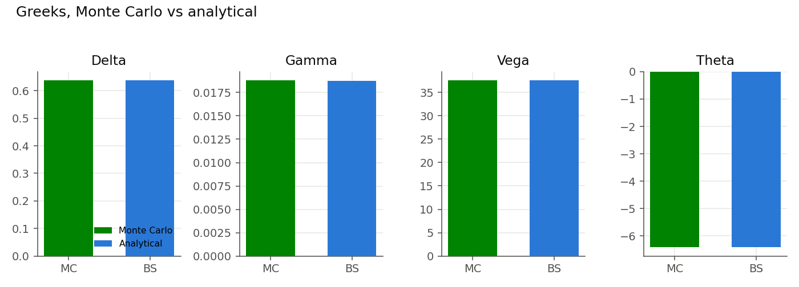
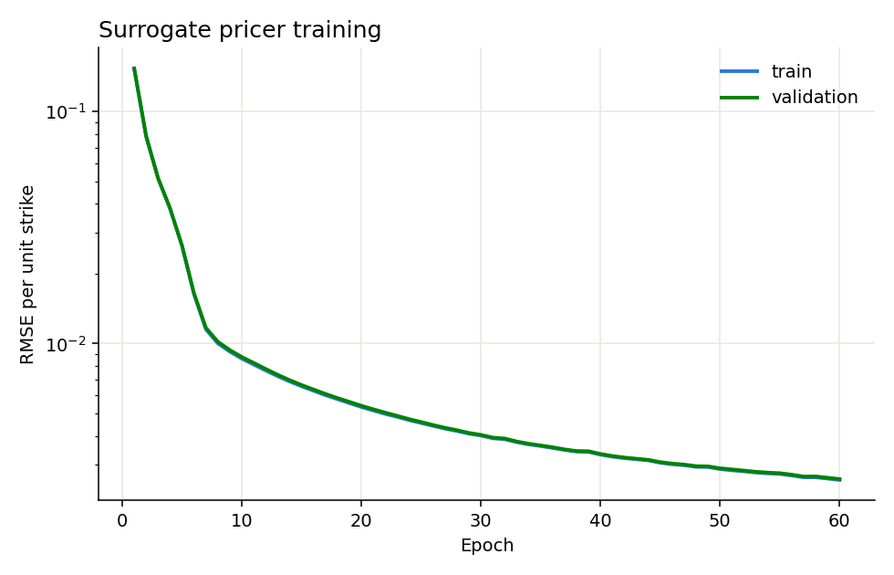

# MonteCarloGPU

**GPU accelerated Monte Carlo option pricing and risk engine.**

MonteCarloGPU prices European, Asian, and barrier options with CUDA accelerated
Monte Carlo simulation, validates them against the analytical Black Scholes
solution, computes Greeks and portfolio risk, and trains a neural surrogate
pricer that values a whole book in microseconds. Everything runs inside a
container and scales from a laptop to an HPC cluster or a Kubernetes GPU pod.

The project targets the financial services GPU workload directly. Pricing, risk,
backtesting, deep learning inference, benchmarking at scale, and performance
reporting are all here as one coherent pipeline.

---

## Highlights

- **Custom CUDA kernels** for European, Asian, and barrier options using cuRAND
  Philox, warp shuffle reductions, and single precision throughput.
- **Portable PyTorch engine** that runs the same pricing code on CUDA, Apple
  MPS, or CPU, so the benchmark produces a GPU number on any machine.
- **Neural surrogate pricer** in PyTorch with a full train, evaluate, and infer
  lifecycle. It prices around 545,000 options per second at inference.
- **Portfolio risk and backtesting.** Monte Carlo Value at Risk on a correlated
  book, and a delta hedging backtest that ties the Greeks to a trading workflow.
- **Runs at scale.** Slurm batch scripts and a Kubernetes Job, plus a Docker
  image that packages the whole workload.
- **Performance reporting.** A JSON benchmark suite, four validated charts, and a
  self contained HTML dashboard.
- **Validated.** 20 Python tests plus a C++ Google Test suite. The Monte Carlo
  price matches Black Scholes and the convergence rate matches theory.

---

## Performance

Reference European call. Spot 100, strike 100, rate 5 percent, volatility 20
percent, one year, 252 steps. Measured on Apple MPS on the development machine.
On an NVIDIA datacenter GPU the custom CUDA kernels run faster still, and the
same scripts regenerate every number inside the GPU container.



| Paths | CPU NumPy | GPU | Speedup |
|-------|-----------|-----|---------|
| 100,000 | 376 ms | 21 ms | 17.5x |
| 1,000,000 | 3,650 ms | 132 ms | 27.7x |
| 10,000,000 | 37,675 ms | 595 ms | **63.4x** |

Full numbers are in [docs/RESULTS.md](docs/RESULTS.md).

---

## Quick start

### With Docker and a GPU

```bash
docker compose up --build
# Benchmark JSON and charts appear in results/
```

The container needs the NVIDIA Container Toolkit. It builds the CUDA engine and
runs the benchmark, the convergence study, and the chart generation.

### Locally with Python

The PyTorch path runs anywhere, no CUDA toolkit required.

```bash
pip install -r python/requirements.txt

python3 python/benchmark.py          # CPU vs GPU benchmark, writes results/
python3 python/convergence.py        # convergence study
python3 python/surface.py            # price surface
python3 python/plot_results.py       # generate the charts
python3 -m pytest                    # run the test suite
```

### Command line pricer (CUDA build)

```bash
cmake -B build -DCMAKE_BUILD_TYPE=Release && cmake --build build
./build/montecarlo_gpu --type european --spot 100 --strike 100 \
    --rate 0.05 --vol 0.2 --maturity 1.0 --paths 10000000 --greeks
```

---

## Option types

| Type | Payoff | Priced at 10M paths |
|------|--------|---------------------|
| European call | max(S_T - K, 0) | 10.4474 |
| Asian call | max(average(S) - K, 0) | 5.7794 |
| Up and out barrier call | European call unless S crosses B | 1.3287 |

The Asian call is cheaper because averaging dampens variance. The barrier call
is cheaper still because it can knock out.

---

## Convergence

Monte Carlo error shrinks as one over the square root of the path count. Fitting
the log standard error against the log path count recovers a slope of -0.5002,
matching the theoretical -0.5. The estimate converges to the analytical Black
Scholes price as paths increase.



---

## Greeks

Delta, gamma, vega, and theta by finite difference with common random numbers,
validated against analytical Black Scholes. Reusing one seed across the bumped
runs correlates the paths so most of the Monte Carlo noise cancels.



---

## Neural surrogate pricer

A PyTorch MLP learns the pricing map and values a whole book in one forward pass.
It reaches a test RMSE of 0.0026 per unit strike and prices around 545,000
options per second at under 2 microseconds each. This is the fast approximate
path a real time risk desk uses alongside exact Monte Carlo. Full lifecycle in
[ml/README.md](ml/README.md).



---

## Running at scale

The same container runs on the two schedulers you meet on real GPU
infrastructure. See [orchestration/README.md](orchestration/README.md).

```bash
sbatch orchestration/slurm/benchmark.sbatch        # HPC cluster, one GPU
sbatch orchestration/slurm/sweep.sbatch            # parameter sweep, job array
kubectl apply -f orchestration/k8s/benchmark-job.yaml   # Kubernetes GPU pod
```

---

## Architecture

```
include/mc/        C++ and CUDA headers, financial types, Black Scholes
src/kernels/       CUDA kernels, European, Asian, barrier, warp reductions
src/               host pricer orchestration and the CLI
python/mcgpu/      portable engine, CPU and PyTorch pricers, portfolio, backtest
python/            benchmark, convergence, surface, and plotting scripts
ml/                neural surrogate pricer, data, train, evaluate, infer
orchestration/     Slurm batch scripts and Kubernetes manifests
dashboard/         self contained HTML performance dashboard
test/              C++ Google Test suite
tests/             Python pytest suite
docs/              methodology and results
```

The pricing math lives in one place and is shared by every layer. The CUDA
kernels are the production path. The PyTorch engine is the portable path and the
source of the neural surrogate training labels. See
[docs/METHODOLOGY.md](docs/METHODOLOGY.md) for the financial math and the GPU
design notes.

---

## Testing

```bash
python3 -m pytest                    # 20 Python tests
# C++ tests build inside the GPU container
cmake -B build -DMC_BUILD_TESTS=ON && cmake --build build && ctest --test-dir build
```

Continuous integration runs the Python suite and a benchmark smoke test on every
push. See [.github/workflows/ci.yml](.github/workflows/ci.yml).

---

## License

MIT. See [LICENSE](LICENSE).
